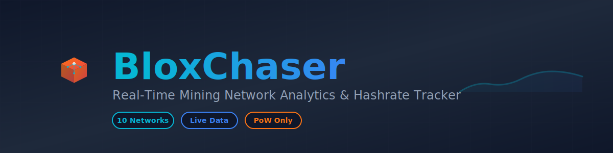

<div align="center">
  

  <p align="center">
    <strong>Real-Time Mining Network Analytics & Hashrate Tracker</strong>
  </p>

  <p align="center">
    Monitor the pulse of Proof-of-Work networks in real-time
  </p>

  <p align="center">
    <a href="https://bloxchaser.com">
      
    </a>
    <a href="https://nextjs.org/">
      
    </a>
    <a href="https://www.typescriptlang.org/">
      
    </a>
    <a href="https://tailwindcss.com/">
      
    </a>
  </p>
</div>

---

# BloxChaser

BloxChaser is a comprehensive mining network analytics dashboard that tracks hashrate trends, difficulty adjustments, network health, and price data for top mineable cryptocurrencies.

## Features

### Core Analytics
- 📊 **Real-time hashrate tracking** for 11 major PoW cryptocurrencies
- 📈 **Historical charts** showing 90 days of network data with real blockchain data
- 🔥 **Trend analysis** - 7d, 30d, 90d hashrate changes with sparkline visualizations
- ⚡ **Live difficulty tracking** with readable formatting (P/T/G/M units)
- 💰 **Price tracking** with 24h change and market cap data
- 🎨 **Beautiful, responsive UI** with glassmorphic cards and smooth animations

### Interactive Tools
- 💵 **Profit Calculator** - Estimate daily/monthly earnings based on your hashrate
- 📊 **Sparkline Charts** - Visual 7d/30d/90d trend indicators on each card
- 🎯 **Branded Coin Logos** - Color-matched icons with glow effects
- 🐦 **Twitter Share** - Share hashrate stats with $cashtags and @blxchaser mentions
- 🔄 **Market Cap Sorting** - Networks automatically ranked by market capitalization

### Technical Excellence
- 🚀 **Server-Side Rendering (SSR)** with Incremental Static Regeneration (ISR)
- 📱 **Mobile-responsive** design for all screen sizes
- 🔒 **Enterprise-level security** with comprehensive HTTP headers
- 🔍 **SEO-optimized** with Open Graph and Twitter Card metadata
- ⚖️ **Legal compliance** with Terms of Use and Privacy Policy pages
- 🔄 **Auto-refresh** data fetching with 5-minute cache

## Supported Cryptocurrencies

| Coin | Symbol | Algorithm | Hashrate Source | Price Source | Unit |
|------|--------|-----------|-----------------|--------------|------|
| Bitcoin | BTC | SHA-256 | Mempool.space | CoinGecko / CoinPaprika / CryptoCompare | EH/s |
| Ethereum Classic | ETC | Etchash | Blockscout + Minerstat | CoinGecko / CoinPaprika / CryptoCompare | TH/s |
| Bitcoin Cash | BCH | SHA-256 | Mempool.space | CoinGecko / CoinPaprika / CryptoCompare | EH/s |
| Litecoin | LTC | Scrypt | Litecoinspace.org | CoinGecko / CoinPaprika / CryptoCompare | TH/s |
| Monero | XMR | RandomX | Minerstat | CoinGecko / CoinPaprika / CryptoCompare | GH/s |
| Kaspa | KAS | kHeavyHash | api.kaspa.org | CoinGecko / CoinPaprika / CryptoCompare | PH/s |
| Zcash | ZEC | Equihash | zcashblockexplorer.com | CoinGecko / CoinPaprika / CryptoCompare | MSol/s |
| Dogecoin | DOGE | Scrypt | GetBlock RPC | CoinGecko / CoinPaprika / CryptoCompare | PH/s |
| Ergo | ERG | Autolykos v2 | Minerstat | CoinGecko / CoinPaprika / CryptoCompare | TH/s |
| Ravencoin | RVN | KawPow | Blockbook | CoinGecko / CoinPaprika / CryptoCompare | TH/s |
| Conflux | CFX | Octopus | Minerstat | CryptoCompare | TH/s |

### Price Data Fallback Chain
1. **CoinGecko API** (primary - fastest updates)
2. **CoinPaprika API** (backup - no API key required)
3. **CryptoCompare API** (tertiary - fetches all 11 coins in one call)
4. **Minerstat API** (final fallback)

This ensures financial data is never missing due to API rate limiting or outages.

## Getting Started

### Prerequisites

- Node.js 18+
- npm or yarn

### Installation

```bash
# Clone the repository
git clone https://github.com/bokiko/bloxchaser.git
cd bloxchaser

# Install dependencies
npm install

# Run the development server
npm run dev
```

Open [http://localhost:3000](http://localhost:3000) to view the dashboard.

### Build for Production

```bash
npm run build
npm start
```

## Tech Stack

### Frontend & Framework
- **Next.js 16.0.3** - React framework with App Router
- **React 19** - UI library
- **TypeScript 5.0** - Type safety
- **Tailwind CSS 4.0** - Utility-first styling

### Visualization & UI
- **Chart.js + react-chartjs-2** - Sparkline charts
- **Recharts** - Full historical charts
- **date-fns** - Date formatting and manipulation

### Data Sources
- **Mempool.space API** - Bitcoin & Bitcoin Cash hashrate/history
- **Litecoinspace.org API** - Litecoin hashrate/history
- **GetBlock Public RPC** - Dogecoin hashrate
- **api.kaspa.org** - Kaspa network data
- **api.ergoplatform.com** - Ergo blockchain data
- **Blockscout API** - ETC price, market cap, historical data
- **Blockbook API** - Ravencoin hashrate & historical blocks
- **Minerstat API v2** - XMR, multi-coin backup data
- **CoinGecko API** - Primary price source
- **CoinPaprika API** - Price fallback (no API key)

### Infrastructure
- **Vercel** - Deployment platform
- **axios** - HTTP client
- **Server-Side Rendering (SSR)** - Optimal SEO & performance
- **Incremental Static Regeneration (ISR)** - 5-minute revalidation

### Security Headers
- Content-Security-Policy (CSP)
- X-Content-Type-Options
- X-Frame-Options
- Referrer-Policy

## Project Structure

```
bloxchaser/
├── app/
│   ├── coin/
│   │   └── [symbol]/
│   │       └── page.tsx          # Individual coin detail page with charts
│   ├── legal/
│   │   ├── terms/
│   │   │   └── page.tsx          # Terms of Use page
│   │   └── privacy/
│   │       └── page.tsx          # Privacy Policy page
│   ├── api/
│   │   ├── hashrate/
│   │   │   └── route.ts          # API endpoint for real-time stats
│   │   └── history/
│   │       ├── route.ts          # GET /api/history (list all coins)
│   │       └── [symbol]/
│   │           └── route.ts      # GET /api/history/{symbol}
│   ├── page.tsx                  # Main dashboard page
│   ├── layout.tsx                # Root layout with metadata
│   └── globals.css               # Global styles (Tailwind v4)
├── components/
│   ├── NetworkCard.tsx           # Coin stats card with logos & profit calc
│   ├── NetworkView.tsx           # Card/Table view toggle component
│   ├── HashrateChart.tsx         # Historical hashrate chart component
│   ├── Sparkline.tsx             # Mini trend chart component
│   ├── WhatsNewModal.tsx         # First-visit feature announcement
│   ├── CoinTabs.tsx              # Financial/Network tabs switcher
│   └── BackButton.tsx            # Client-side navigation component
├── data/
│   └── history/                  # Historical data storage (90 days)
│       ├── btc-history.json
│       ├── ltc-history.json
│       ├── ... (10 coin files)
│       └── cfx-history.json
├── scripts/
│   ├── fetch-difficulty.mjs      # Collects data every 4 hours
│   └── backfill-history.mjs      # One-time 90-day backfill
├── lib/
│   ├── fetchBitcoinData.ts       # Bitcoin data fetcher (Mempool.space)
│   ├── fetchLitecoinData.ts      # Litecoin data fetcher (Litecoinspace)
│   ├── fetchDogecoinData.ts      # Dogecoin data fetcher (GetBlock RPC)
│   ├── fetchKaspaData.ts         # Kaspa data fetcher (api.kaspa.org)
│   ├── fetchErgoData.ts          # Ergo data fetcher (Minerstat)
│   ├── fetchEthereumClassicData.ts # ETC data fetcher (Blockscout)
│   ├── fetchRavencoinData.ts     # Ravencoin data fetcher (Blockbook)
│   ├── fetchZcashData.ts         # Zcash data fetcher (zcashblockexplorer)
│   ├── fetchBitcoinCashData.ts   # Bitcoin Cash data fetcher
│   ├── fetchMinerstatData.ts     # Multi-coin data fetcher (Minerstat)
│   ├── fetchPrices.ts            # Price fetcher (CoinGecko/CoinPaprika/CryptoCompare)
│   └── historicalData.ts         # Historical data reader helper
├── .github/
│   └── workflows/
│       └── update-difficulty.yml # GitHub Actions (every 4 hours)
├── types/
│   └── index.ts                  # TypeScript type definitions
├── TERMS_OF_USE.md               # Full Terms of Use document
├── PRIVACY_POLICY.md             # Full Privacy Policy document
└── CLAUDE_UPDATE.md              # Development session notes
```

## API Endpoints

### GET /api/history
Returns a summary of all coins with historical data available.

**Response Format:**
```json
{
  "success": true,
  "coins": [
    { "symbol": "BTC", "name": "Bitcoin", "entries": 13141, "lastUpdated": "2025-11-24T..." }
  ],
  "supportedCoins": ["BTC", "LTC", "XMR", "DOGE", "KAS", "ETC", "RVN", "ZEC", "BCH", "ERG", "CFX"],
  "updateFrequency": "Every 4 hours",
  "apiVersion": "1.0"
}
```

### GET /api/history/{symbol}
Returns full historical data for a specific coin. Supports query parameters:
- `?days=30` - Limit data to last N days
- `?format=compact` - Return compact format for charting

**Response Format:**
```json
{
  "success": true,
  "coin": "BTC",
  "name": "Bitcoin",
  "algorithm": "SHA-256",
  "data": [
    { "timestamp": 1700000000, "datetime": "2025-...", "hashrate": 725.45, "difficulty": 102290000000000, "price": 98234.56 }
  ],
  "totalEntries": 13141,
  "updateFrequency": "Every 4 hours"
}
```

### GET /api/hashrate

Returns real-time network statistics for all supported coins.

**Response Format:**
```json
{
  "success": true,
  "data": [
    {
      "coin": "Bitcoin",
      "symbol": "BTC",
      "currentHashrate": 725.45,
      "currentDifficulty": 102290000000000,
      "change7d": 2.34,
      "change30d": -1.23,
      "change90d": 15.67,
      "lastUpdated": 1700000000000,
      "historicalData": [...],
      "currentPrice": 98234.56,
      "priceChange24h": 3.45,
      "marketCap": 1920000000000
    }
  ],
  "timestamp": 1700000000000
}
```

**Caching**: 5 minutes (300 seconds)

## Features Deep Dive

### Profit Calculator
Each network card includes a collapsible profit calculator:
- Input your hashrate in the network's native unit
- Automatically calculates daily/monthly USD earnings
- Formula: `(user_hash / network_hash) * blocks_per_day * block_reward * price`
- Accounts for current network difficulty and coin price

### Sparkline Charts
Visual trend indicators on each card showing:
- 7-day, 30-day, and 90-day hashrate trends
- Color-coded (green = up, red = down)
- Powered by Chart.js for smooth rendering

### Twitter Sharing
Share network stats directly to Twitter with:
- Proper $cashtags ($BTC, $KAS, etc.)
- @blxchaser mention for brand visibility
- Hashrate trend data (7d change)
- Example: "$BTC hashrate +2.3% (7d) 📊 Check @blxchaser for real-time mining stats"

### Coin Logos
Each card features branded coin logos:
- Color-matched to official brand colors
- Glow effects on hover
- Consistent 32x32px sizing
- Glassmorphic background styling

## Data Sources & Limits

- **Mempool.space**: No API key required, public endpoint
- **Litecoinspace.org**: No API key required, public endpoint
- **api.kaspa.org**: No API key required, official Kaspa API
- **api.ergoplatform.com**: No API key required, official Ergo API
- **Blockscout (ETC)**: No API key required, public blockchain explorer
- **Blockbook (RVN)**: No API key required, public Ravencoin blockchain explorer
- **zcashblockexplorer.com**: No API key required, public Zcash explorer
- **Minerstat API**: Free tier, 12 requests/minute
- **GetBlock RPC**: Public endpoint for Dogecoin
- **CoinGecko**: Free tier, rate limited (primary price source)
- **CoinPaprika**: Free tier, 5-minute updates, no API key required (price fallback)
- **CryptoCompare**: API key required, fetches all 11 coins in one call (tertiary price fallback)

All APIs are used responsibly with appropriate caching (5-minute) to minimize requests and prevent rate limiting.

## Architecture & Performance

### Server-Side Rendering (SSR)
BloxChaser uses Next.js 16 Server Components for optimal performance and SEO:

- **Full HTML on first load**: Crawlers and users see complete content immediately
- **No loading states for bots**: SEO-friendly, perfect for Google, social media previews
- **Incremental Static Regeneration (ISR)**: Pages revalidate every 5 minutes
- **Static generation**: All 10 coin detail pages are pre-rendered at build time

### Security Features

All HTTP responses include enterprise-grade security headers:

- **Content-Security-Policy (CSP)**: Prevents XSS attacks by whitelisting trusted sources
- **X-Content-Type-Options**: Prevents MIME-type sniffing attacks
- **X-Frame-Options**: Prevents clickjacking attacks
- **Referrer-Policy**: Controls referrer information for privacy

All external API calls are made server-side, keeping API endpoints secure and never exposed to the browser.

### SEO Optimization

- Comprehensive Open Graph and Twitter Card metadata
- Semantic HTML with proper heading hierarchy
- Optimized meta descriptions with relevant keywords
- Crawler-friendly URLs and navigation structure
- Dynamic sitemap generation

## Data Transparency

Historical hashrate data (90 days) is calculated from real blockchain data where available:
- **Ravencoin**: Fetches actual historical block difficulties at 7d, 30d, 90d intervals
- **Ergo**: Samples historical blocks at specific offsets (720 blocks/day)
- **Zcash**: Uses block difficulty data from public explorer
- **Other coins**: Historical data points are sampled based on current network statistics

Current network data (hashrate, difficulty, price) is fetched in real-time from authoritative sources.

## Contributing

Contributions are welcome! Feel free to:
- Add support for more PoW coins
- Improve the UI/UX
- Add new features (alerts, comparisons, advanced calculators)
- Optimize data fetching and caching
- Fix bugs or improve documentation

## Roadmap

### Completed Features ✅
- [x] Bitcoin (BTC)
- [x] Ethereum Classic (ETC)
- [x] Bitcoin Cash (BCH)
- [x] Litecoin (LTC)
- [x] Monero (XMR)
- [x] Kaspa (KAS)
- [x] Zcash (ZEC)
- [x] Dogecoin (DOGE)
- [x] Ergo (ERG)
- [x] Ravencoin (RVN)
- [x] Conflux (CFX)
- [x] Profit Calculator
- [x] Sparkline Charts
- [x] Coin Logo Branding
- [x] Twitter Share Integration
- [x] Market Cap Sorting
- [x] What's New Modal
- [x] Historical Data API (90 days)
- [x] Public API Endpoints
- [x] Automated Data Collection (GitHub Actions)

### Planned Features 🚀
- [ ] More PoW networks coming soon
- [ ] Email/SMS alerts for hashrate changes
- [ ] Network comparison tool
- [ ] Advanced profitability calculator (hardware specs, electricity costs)
- [ ] Mining pool distribution data
- [ ] Historical difficulty charts
- [ ] Mobile app (React Native)
- [ ] Dark/Light theme toggle
- [ ] Multi-currency support (EUR, GBP, etc.)

## License

MIT License - see LICENSE file for details

## Acknowledgments

- Mempool.space for Bitcoin & Bitcoin Cash hashrate data
- Litecoinspace.org for Litecoin network data
- api.kaspa.org for official Kaspa hashrate API
- Minerstat for Ergo, Conflux, Monero network data and historical data API
- Blockscout for Ethereum Classic blockchain data
- Blockbook for Ravencoin blockchain data & historical blocks
- zcashblockexplorer.com for Zcash network data
- GetBlock for Dogecoin RPC access
- CoinGecko for primary price data
- CoinPaprika for reliable price fallback (no API key required)
- CryptoCompare for comprehensive price data (11 coins in one API call)

---

**Built for miners, by miners. Track the hashrate, chase the blocks.**

🐦 Follow us on Twitter: [@blxchaser](https://twitter.com/blxchaser)
🌐 Live Dashboard: [bloxchaser.com](https://bloxchaser.com)
